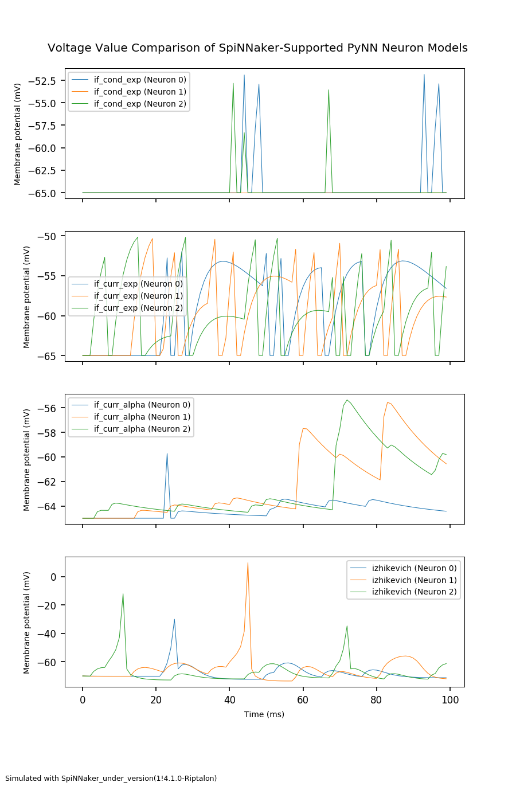

# An Introduction to Spiking Neural Networks (SNNs)


*Photo by [Scott Webb](https://unsplash.com/@scottwebb) on [Unsplash](https://unsplash.com/).*

This repository contains introductory level SNN examples that I built to understand more about the neuron models and the main network types by using _sPyNNaker_ (_PyNN_ for _SpiNNaker_).

---

## Setup
### Software
#### Necessary Python Packages
* [sPyNNaker8](https://github.com/SpiNNakerManchester/sPyNNaker8)
* matplotlib (2.2.3)
* PyNN (0.9.3)*
* numpy (1.16.0)

Along with Python 2.7.

#### Included Files and Their Usage

```
spynnaker-examples/
├── compare_voltages.png
├── compare_voltages.py
├── empty_snn_pattern.py
├── izhikevich_snn.py
├── one_neuron_if_curr_exp.py
├── one_neuron_izhikevich.py
├── recurrent_network.py
├── snn_if_cond_exp.py
├── snn_if_curr_alpha.py
├── snn_if_curr_exp.py
└── util
    ├── basic_visualizer.py
    ├── basic_visualizer.pyc
    ├── __init__.py
    └── __init__.pyc
```

Each python file could be run separately except *basic_visualizer.py* and *empty_snn_pattern.py*. 

Folder _util_ includes utility library *basic_visualizer* which contains plotting functions.

*empty_snn_pattern.py* is a pattern python file which is reproducible by filling the sections. I built this as a template for my codes.

<p align="center">
  
</p>

<p align="center">
  <i>Comparisons of neuron models in sPyNNaker8 with default values, reference <a href="https://github.com/mervess/spynnaker-examples/blob/master/compare_voltages.py">compare_voltages.py</a>.</i>
</p>

---

### Hardware
SpiNNaker neuromorphic hardware resource is used in this project. Please refer to [SpiNNaker project page](http://apt.cs.manchester.ac.uk/projects/SpiNNaker/) regarding its setup and usage.

**Notes**

*You can run these examples on a different neuromorphic hardware resource or a simulator as well. Please see [PyNN documentation](http://neuralensemble.org/PyNN/) for alternatives.

